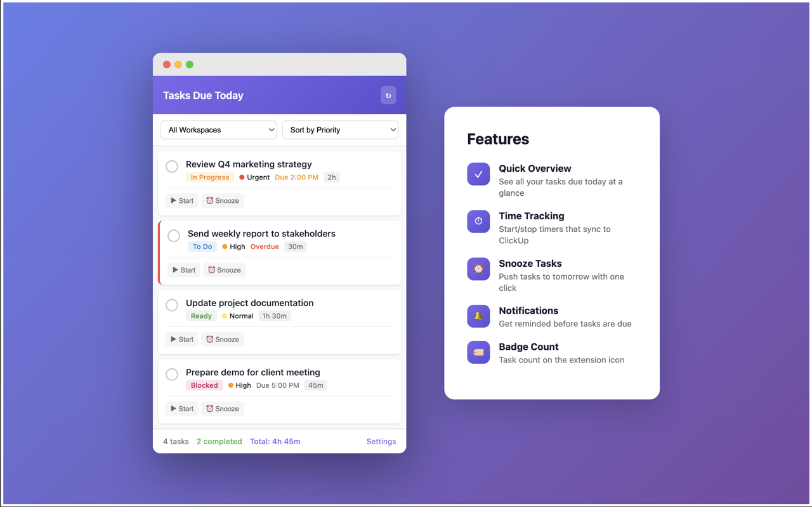

# ClickUp Due Today

A Chrome extension that gives you a quick overview of your ClickUp tasks due today, right from your browser toolbar.



## Features

- **Quick Overview** - See all your tasks due today at a glance
- **Complete Tasks** - Mark tasks as done without leaving your current tab
- **Time Tracking** - Start/stop timers that automatically log to ClickUp
- **Snooze Tasks** - Push tasks to tomorrow, in 2 days, or next week
- **Overdue Tasks** - Optionally show overdue tasks with visual indicators
- **Due Time Display** - See specific due times when set
- **Workspace Filter** - Filter tasks by workspace
- **Sort Options** - Sort by priority, due time, estimate, or name
- **Group by List** - Organize tasks by their parent list
- **Badge Count** - See task count on the extension icon
- **Desktop Notifications** - Get notified before tasks are due
- **Time Tracked vs Estimated** - Monitor progress against estimates
- **Completed Today Count** - See how many tasks you've completed today

## Installation

### From Chrome Web Store
*Coming soon*

### Manual Installation (Developer Mode)
1. Download or clone this repository
2. Open Chrome and go to `chrome://extensions/`
3. Enable **Developer mode** (toggle in top right)
4. Click **Load unpacked**
5. Select the extension folder

## Setup

1. Click the extension icon in your browser toolbar
2. Click **Settings**
3. Enter your ClickUp API key:
   - Go to [ClickUp Settings > Apps](https://app.clickup.com/settings/apps)
   - Scroll to **API Token** and generate or copy your token
   - Paste it in the extension settings
4. Configure which features you want enabled
5. Click **Save**

## Privacy

This extension:
- Stores your API key locally in Chrome's secure storage
- Only communicates with ClickUp's official API
- Does not collect or transmit any data to third parties
- Is fully open source for transparency

See our full [Privacy Policy](PRIVACY_POLICY.md).

## Development

### Prerequisites
- Node.js (for icon generation)

### Setup
```bash
# Install dependencies
npm install

# Generate icons (if needed)
npm run generate-icons
```

### Project Structure
```
├── manifest.json      # Extension configuration
├── popup.html/js/css  # Main popup UI
├── options.html/js    # Settings page
├── background.js      # Badge & notifications
├── icons/             # Extension icons
└── screenshots/       # Store listing assets
```

## Contributing

Contributions are welcome! Please feel free to submit a Pull Request.

## License

MIT License - see [LICENSE](LICENSE) for details.

## Disclaimer

This extension is not affiliated with, endorsed by, or sponsored by ClickUp.
